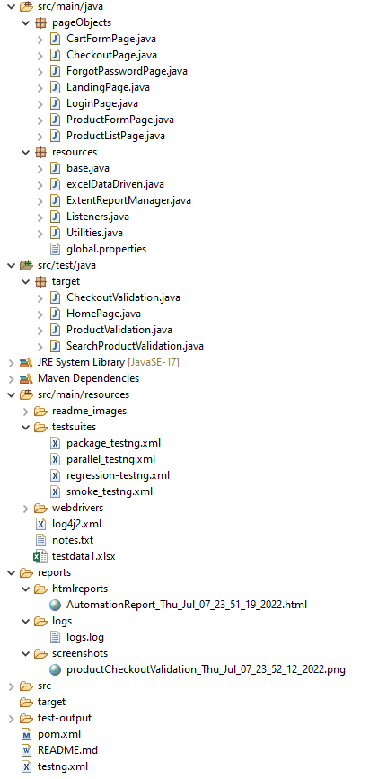
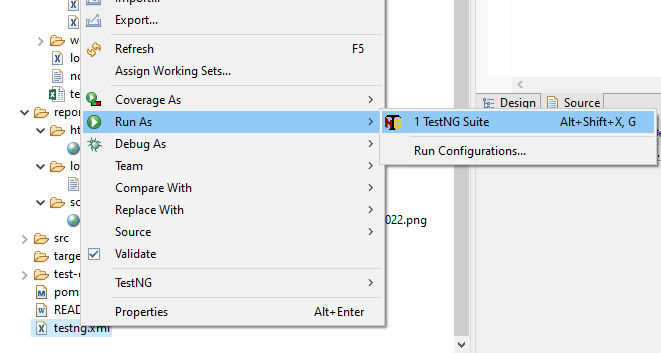
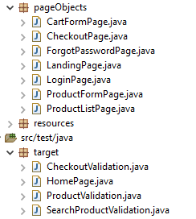
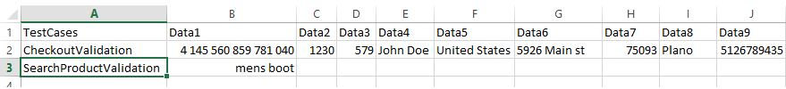
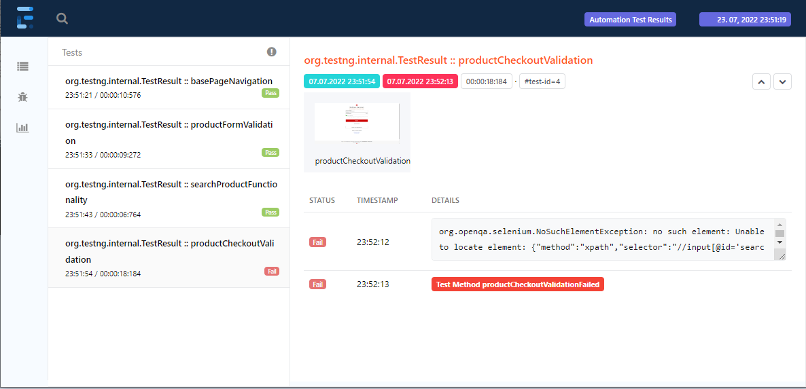
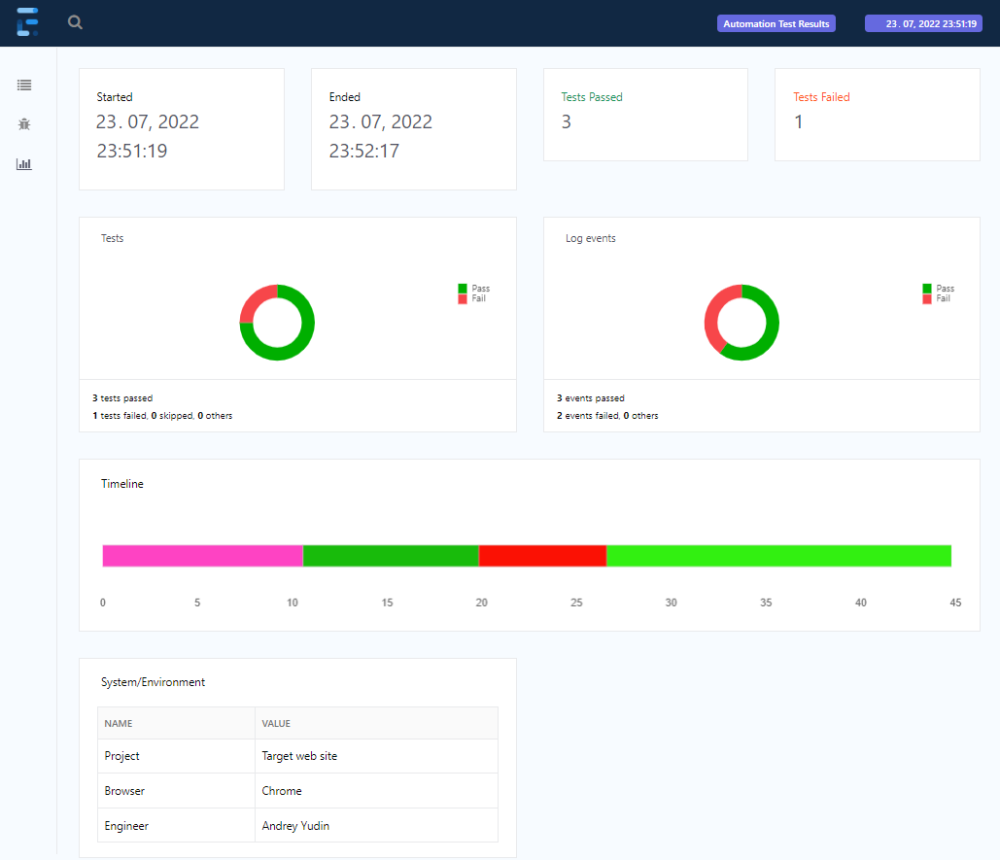

<b><h3>[1. Project description](#description)</h3></b>

<b><h3>[2. How to run](#howtorun)</h3></b>

<b><h3>[3. Implemented Details](#details)</h3></b>
- [OOPS concepts achieved](#oops)
- [Parametrizing](#parametrizing)
- [Reusable methods](#methods)
- [Page object mechanism](#pageobject)
- [Data driven from excel, DataProvider](#datadriven)
- [Listeners](#listeners)
- [Extent Reports](#reports)
- [Logs](#logs)
- [Screenshots capturing](#screenshots)

<a id="description"></a>
## __1. Project description__

This is a Selenium Java project with Page Object Mechanism (designing patterns for tests development) built using Maven (build management tool), TestNG (Unit Testing Framework), Data Driven concepts from external resources, generating Logs, Reports, Capturing Screenshots.

At the moment, the added tests have been directed to verify only the basic functionalities as Login, Home page, Search Product, List of products and product forms, Checkout validation.

Structure:



<a id="howtorun"></a>
## __2. How to run__

To run this project you need to make sure you have installed Java, Eclipse or another ide, Maven with setting up Java, Maven home paths on your machine.

Clone this project and import it from the file system using IDE (as Eclipse IDE).

Run this project As TestNG Suite for [_testng.xml_](https://github.com/andrey-yudin-7/SeleniumFramework/blob/master/testng.xml) file:




Or from command line:
```
andre@DESKTOP-0CPI2F2 MINGW64 /d/QA_projects/SeleniumFramework (master)
$ mvn test -Dbrowser=chrome
```

<a id="details"></a>
## __3.Implemented Details__
<a id="oops"></a>
* ### __3.1 OOPS concepts achieved__:
    * __Abstraction__ achieved by interfaces.

    As example By creating a reference variable (driver) of the interface (WebDriver) and creating an Object - as from [_base.java_](https://github.com/andrey-yudin-7/SeleniumFramework/blob/master/src/main/java/resources/base.java)
    ```
    public WebDriver = new ChromeDriver();
    ```
    as another example from [_Listeners.java_](https://github.com/andrey-yudin-7/SeleniumFramework/blob/master/src/main/java/resources/Listeners.java) where used __implements ItestListener__ interface:
    ```
    public class Listeners extends base implements ITestListener {
    ```
    
    * __Encapsulation__ - achieved using private locators with public methods to avoid misuse the coding standards of the framework.
    
    Example from [_CheckoutPage.java_](https://github.com/andrey-yudin-7/SeleniumFramework/blob/master/src/main/java/pageObjects/CheckoutPage.java):
    ```
    private By addressCity = By.id("addressFormInput-city");
    
	public WebElement getAddressCity() {
		return driver.findElement(addressCity);
	}
    ```


    * __Polymorphism__ - achieved using combination of overloading and overriding.

    Used Implicit wait as an example of overloading from [_base.java_](https://github.com/andrey-yudin-7/SeleniumFramework/blob/master/src/main/java/resources/base.java):
    ```
    driver.manage().timeouts().implicitlyWait(Duration.ofSeconds(10));
    ```
    another example of overloading used in Framework:
    ```
    .findElement(“<All type of locator e.g. id , xpath , cssClass>”).
    ```

    overriding methods used in [_Listeners.java_](https://github.com/andrey-yudin-7/SeleniumFramework/blob/master/src/main/java/resources/Listeners.java). As example:
    ```
        @Override		
        public void onTestSuccess(ITestResult result) {					
    	String logText = "<b> Test Method " + result.getMethod().getMethodName() + " Successfull<b>";
    	Markup m = (Markup) MarkupHelper.createLabel(logText, ExtentColor.GREEN);
    	extentTest.get().log(Status.PASS, m);
    }	
    ```

    * __Inheritance__ - achieved using extends base as an example in test classes.
    Where methods declared in _base.java_ called in child classes. As example in [_HomePage.java_](https://github.com/andrey-yudin-7/SeleniumFramework/blob/master/src/test/java/target/HomePage.java) we are getting intializeDriver() method declared in [_base.java_](https://github.com/andrey-yudin-7/SeleniumFramework/blob/master/src/main/java/resources/base.java) without creating any object:
    
    ```
    public class HomePage extends base {
    public void initialize() throws IOException
	{
		driver = intializeDriver();
	}
    ......
    ```
<a id="parametrizing"></a>
### __3.2 Parametrizing with different browsers execution, different run mode for local execution and via maven commands, global.properties__. 
Implemented parametrizing with different browsers (chrome, firefox, edge), webdrivers, different run modes for local execution and via maven commands (local_ide, maven_command).

From [_global.properties_](https://github.com/andrey-yudin-7/SeleniumFramework/blob/master/src/main/java/resources/global.properties):
```
browser=chrome
chromeDriverVersion=103.0.5060.53
firefoxDriverVersion=0.31.0
edgeDriverVersion=103.0.1264.37
#################Project################
projectName=Target website
url=https://www.target.com/
userLogin=
userPassword=
########run mode - local_ide or maven_command######
runMode=local_ide
#################################################
```

From [_base.java_](https://github.com/andrey-yudin-7/SeleniumFramework/blob/master/src/main/java/resources/base.java):
```
String browserName;
		String runMode = (String) prop.get("runMode");
		
		if (runMode.contains("maven_command")) {
			//Jenkins, maven command
			browserName = System.getProperty("browser");
		}
		else
		{
			browserName = prop.getProperty("browser");
		}

		if (browserName.contains("chrome")) {
			System.setProperty("webdriver.chrome.driver", System.getProperty("user.dir")
					+ "\\src\\main\\resources\\webdrivers\\chromedriver\\" + prop.getProperty("chromeDriverVersion") + "\\chromedriver.exe");
			ChromeOptions options = new ChromeOptions();
			if (browserName.contains("headless")) {
				options.addArguments("headless");
			}
			driver = new ChromeDriver(options);
		} else if (browserName.equals("firefox")) {
			System.setProperty("webdriver.gecko.driver", System.getProperty("user.dir")
					+ "\\src\\main\\resources\\webdrivers\\firefox\\" + prop.getProperty("firefoxDriverVersion") + "\\geckodriver.exe");
			driver = new FirefoxDriver();
		} else if (browserName.equals("edge")) {
			System.setProperty("webdriver.edge.driver", System.getProperty("user.dir")
					+ "\\src\\main\\resources\\webdrivers\\edge\\" + prop.getProperty("edgeDriverVersion") + "\\msedgedriver.exe");
			driver = new EdgeDriver();
		}
```
<a id="methods"></a>
### __3.3 Reusable methods.__
Created [_Utilities.java_](https://github.com/andrey-yudin-7/SeleniumFramework/blob/master/src/main/java/resources/Utilities.java) class_ in resources folder to reduce the code by using reusable methods.
as _scrollToElement()_ and _getGlobalValue()_ (from global.properties)
<a id="pageobject"></a>
### __3.4 Page object mechanism.__ Framework built using page object pattern to achieve the following goals for the project:

    - easy to maintain project;
    - easy readability of scripts;
    - reduce or eliminate duplicacy;
    - re-usability of code;
    - reliability.

For each page created separate page object class to store it's elements and methods used in test classes particular for this page.



As example part of [_LoginPage.java_](https://github.com/andrey-yudin-7/SeleniumFramework/blob/master/src/main/java/pageObjects/LoginPage.java):
```
public class LoginPage {
	
	public WebDriver driver;
	
	private By email = By.id("username");
	private By password = By.xpath("//input[@id='password']");
	private By keepMeSignedIn = By.xpath("//input[@id='keepMeSignedIn']");
	private By submitButton = By.id("login");
	private By forgotPassword = By.cssSelector("#recoveryPassword");
	private By createAccountButton = By.id("createAccount");
	private By usernameErrorMessage = By.id("username--ErrorMessage");
	private By passwordErrorMessage = By.id("password--ErrorMessage");
	private By cantFindAccount = By.xpath("//div[contains(text(),'We can't find your account.')]");
	private By authAlertDisplay = By.xpath("//div[@data-test='authAlertDisplay']");
	
	public LoginPage(WebDriver driver) {
		this.driver=driver;
	}
	
	public void verifyLoginPageElements() {
		Assert.assertTrue(driver.findElement(email).isDisplayed());
		Assert.assertTrue(driver.findElement(password).isDisplayed());
		Assert.assertTrue(driver.findElement(submitButton).isDisplayed());
		Assert.assertTrue(driver.findElement(forgotPassword).isDisplayed());
		Assert.assertTrue(driver.findElement(createAccountButton).isDisplayed());
	}

	public ForgotPasswordPage forgotPassword()
	{
		driver.findElement(forgotPassword).click();
		return new ForgotPasswordPage(driver);
	}
```
<a id="datadriven"></a>
### __3.5 Data driven from excel, DataProvider__
In this framework, the Data driven approach (reading data files and storing input values into variables) is implemented by reading from excel data files:



from [_excelDataDriven.java_](https://github.com/andrey-yudin-7/SeleniumFramework/blob/master/src/main/java/resources/excelDataDriven.java):
```
public class excelDataDriven {
	
	public ArrayList<String> getData(String testcaseName) throws IOException
	{
		ArrayList<String> a = new ArrayList<String>();

		FileInputStream fis = new FileInputStream(System.getProperty("user.dir") + "\\src\\main\\resources\\testdata1.xlsx");
		..........
```

also apart from Data driven from Excel files implemented another Data driven approach by using DataProvider feature provided by TestNG:
```
	@DataProvider
	public Object[][] getUserData()
	{
		Object[][] data = new Object[1][3];
		data[0][0] = "testuser1@mail.com";
		data[0][1] = "pswdt5421";
		data[0][2] = "Not valid user";
		
		return data;
	}
```
```
	@Test(groups={"Smoke"}, dataProvider="getUserData")
	public void basePageNavigation(String username, String password, String text) throws IOException, InterruptedException
	{
		..........
		loginPage.getEmail().sendKeys(username);
		loginPage.getPassword().sendKeys(password);
		..........
```
<a id="listeners"></a>
### __3.6 Listeners__
In this framework added Listeners (an ITestListener interface that modifies the default TestNG's behaviour). They are components in TestNG that listens (keep track) of test execution and helps to perform actions at multiple stages of test execution.

In this framework Listeners are mostly used for the report generating and screenshots capturing on test failures executions. From [_Listeners.java_](https://github.com/andrey-yudin-7/SeleniumFramework/blob/master/src/main/java/resources/Listeners.java)

```
public class Listeners extends base implements ITestListener {
	private static ExtentReports extent = ExtentReportManager.createInstance();
	ExtentTest test;
	private static ThreadLocal<ExtentTest> extentTest = new ThreadLocal<ExtentTest>();
	public static Logger log = LogManager.getLogger(Listeners.class.getName());
	
    @Override		
    public void onTestStart(ITestResult result) {					
    	ExtentTest test = extent.createTest(result.getClass().getName() + " :: " + result.getMethod().getMethodName());
    	extentTest.set(test);
    }
    @Override		
    public void onTestFailure(ITestResult result) {					
    	extentTest.get().fail(result.getThrowable());
    	WebDriver driver = null;
    	String testMethodName = result.getMethod().getMethodName();
    	
    	try {
			driver = (WebDriver)result.getTestClass().getRealClass().getDeclaredField("driver").get(result.getInstance());
		} catch(Exception e)
    	{
			
    	}
    	try {
    		extentTest.get().addScreenCaptureFromPath(getScreenShotPath(testMethodName, driver), result.getMethod().getMethodName());
		} catch (IOException e) {
			extentTest.get().fail("Test failed, cannot attach screenshot");
			log.error("Test failed, cannot attach screenshot");
		}
    	
    	String logText = "<b> Test Method " + testMethodName + "Failed</b>";
    	Markup m = (Markup) MarkupHelper.createLabel(logText, ExtentColor.RED);
    	extentTest.get().log(Status.FAIL, m);
    	log.error("Test failed....Attention! Test name: " +result.getName());
    }
	......
```
<a id="reports"></a>
### __3.7 Extent Reports__
Reports are generating using Extent Reports dependency defined in [_pom.xml_](https://github.com/andrey-yudin-7/SeleniumFramework/blob/master/pom.xml), [_ExtentReportManager.java_](https://github.com/andrey-yudin-7/SeleniumFramework/blob/master/src/main/java/resources/ExtentReportManager.java) (with configs) and [_Listeners.java_](https://github.com/andrey-yudin-7/SeleniumFramework/blob/master/src/main/java/resources/Listeners.java) to trigger report events.





<a id="logs"></a>

### __3.8 Logs__
Logs mechanisme implemented using log4j (log4j-api and log4j-core dependecies in [_pom.xml_](https://github.com/andrey-yudin-7/SeleniumFramework/blob/master/pom.xml)). Logs are stored in \reports\logs folder. Configs are stored in \src\main\resources\ [_log4j2.xml_](https://github.com/andrey-yudin-7/SeleniumFramework/blob/master/src/main/resources/log4j2.xml):
<a id="screenshots"></a>
### __3.9 Screenshots capturing__
Screenshots capturing mechanisme is triggered from [_Listeners.java_](https://github.com/andrey-yudin-7/SeleniumFramework/blob/master/src/main/java/resources/Listeners.java) on test failures:

```
    	try {
    		extentTest.get().addScreenCaptureFromPath(getScreenShotPath(testMethodName, driver), result.getMethod().getMethodName());
		} catch (IOException e) {
			extentTest.get().fail("Test failed, cannot attach screenshot");
			log.error("Test failed, cannot attach screenshot");
		}
```
using getScreenShotPath methods from [_base.java_](https://github.com/andrey-yudin-7/SeleniumFramework/blob/master/src/main/java/resources/base.java):
```
	public String getScreenShotPath(String testCaseName, WebDriver driver) throws IOException {
		Date d = new Date();
		TakesScreenshot ts = (TakesScreenshot) driver;
		File source = ts.getScreenshotAs(OutputType.FILE);
		String destinationFile = System.getProperty("user.dir") + "\\reports\\screenshots\\" 
				+ testCaseName + "_" + d.toString().replace(":", "_").replace(" ", "_") + ".png";
		FileUtils.copyFile(source, new File(destinationFile));
		return destinationFile;
	}
```
